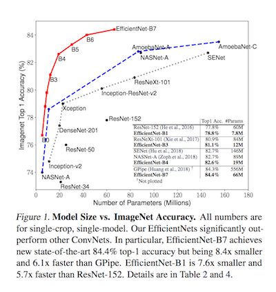
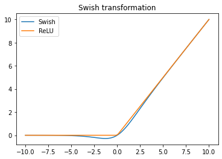

# EfficientNet PyTorch

## Results on ImageNet benchmark



## Activation function
```buildoutcfg
class Swish(nn.Module):
    
    def forward(self, x):
        return x * torch.sigmoid(x)

```

## Visualizing the Swish and ReLU:

```buildoutcfg
import torch
import matplotlib.pylab as plt
%matplotlib inline

d = torch.linspace(-10.0, 10.0)
s = Swish()
res = s(d)
res2 = torch.relu(d)

plt.title("Swish transformation")
plt.plot(d.numpy(), res.numpy(), label='Swish')
plt.plot(d.numpy(), res2.numpy(), label='ReLU')
plt.legend()
```

## EfficientNet versions b0-b7
You can easily change the model's parameters according to these versions below.<br> 
```buildoutcfg
# (width_coefficient, depth_coefficient, resolution, dropout_rate)
'efficientnet-b0': (1.0, 1.0, 224, 0.2),
'efficientnet-b1': (1.0, 1.1, 240, 0.2),
'efficientnet-b2': (1.1, 1.2, 260, 0.3),
'efficientnet-b3': (1.2, 1.4, 300, 0.3),
'efficientnet-b4': (1.4, 1.8, 380, 0.4),
'efficientnet-b5': (1.6, 2.2, 456, 0.4),
'efficientnet-b6': (1.8, 2.6, 528, 0.5),
'efficientnet-b7': (2.0, 3.1, 600, 0.5),
```

## Modife the `efficient.py` file to get desired version of EfficientNet
```buildoutcfg
model = EfficientNet(num_classes=1000, width_coefficient=1.0, depth_coefficient=1.0, dropout_rate=0.2)
```
## Using EfficientNet as a Feature Extractor
In order to use as a feature extractor, some part of the code need to be taken in to comment.<br>
Find the following part of the code from `efficient.py` and change it as following:<br>
```buildoutcfg
# Define head
        self.head = nn.Sequential(
            nn.Conv2d(list_channels[-2], list_channels[-1],
                      kernel_size=1, bias=False),
            nn.BatchNorm2d(list_channels[-1], momentum=0.01, eps=1e-3),
            Swish(),
            nn.AdaptiveAvgPool2d(1),
            Flatten(),
            nn.Dropout(p=dropout_rate),
            nn.Linear(list_channels[-1], num_classes)
        )
```
Changed:
```buildoutcfg
# Define head
        self.head = nn.Sequential(
            nn.Conv2d(list_channels[-2], list_channels[-1],
                      kernel_size=1, bias=False),
            nn.BatchNorm2d(list_channels[-1], momentum=0.01, eps=1e-3),
            Swish(),
          # nn.AdaptiveAvgPool2d(1),
          # Flatten(),
          # nn.Dropout(p=dropout_rate),
          # nn.Linear(list_channels[-1], num_classes)
        )
```
